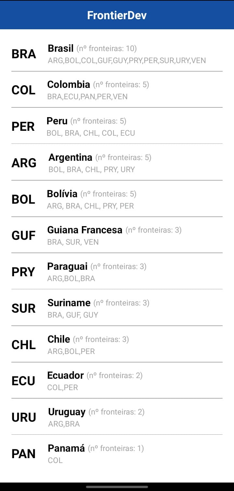

# Tarefa 02

O repósitorio é dividido em duas pastas o client onde está a aplicação mobile e o backend onde está a API. Deve-se rodar primeiro a API e depois compilar o app.

Antes de continuar, clone o repositório:

```bash
git clone https://github.com/adrielfabricio/scale-exercise-2
```

**OBS.: Para funcionamento da API e do App, deve-se abrir um terminal para cada uma das pastas, isto é, em um terminal estará rodando a API e em outro estará rodando o metro do App.**

## Rodando a API

Antes de rodar a API, acesse o diretório `backend/`. Feito isso, siga os passos a seguir:

**1. Instalar pacotes via pip**

```bash
pip install -r requirements.txt
```

**2. Rodar API via Flask**

```bash
flask run
```

Na raiz do diretório `backend/` tem o arquivo `.flaskenv` onde é setada todas as configurações para rodar a API do Flask.

Assim que a API estiver rodando, irá aparecer um log com algumas informações, sendo uma delas a URL da rede local para acessar a API.

```bash
* Running on http://192.168.17.19:8000
```

Deve-se guardar esse URL para usar no App.

## Rodando o App

Antes de rodar a API, acesse o diretório `client/`. Feito isso, siga os passos a seguir:

**1. Instalar as dependências via npm ou yarn**

```bash
# para instalar via yarn
yarn

# para instalar via npm
npm i
```

**2. Criar .env**

Faça uma copia do `.env.example` e renomei esta para `.env`, nela tera a variável `API_URL=`, atribua o valor da URL da API à esta variável da seguinte forma:

```bash
API_URL="http://192.168.17.19:8000"
```

O valor pode variar de acordo com o IP da rede local.

**3. Rodar aplicação no Android ou iOS**

```bash
# para android
yarn android

# para ios
yarn ios
```

**4. Iniciar metro**

```bash
yarn start
```

**Erro de SDK**
Necessário verificar se a SDK do android está instalada em caso de erro de SDK na máquina para poder rodar a aplicação no emulador, neste caso, deve-se considerar os passos a seguir.

1. Vá até a pasta `android/`
2. Crie um arquivo `local.properties`
3. Abra o arquivo
4. Cole o caminho para a SDK do Android como se segue:
   - no Windows `sdk.dir = C:\\Users\\USERNAME\\AppData\\Local\\Android\\sdk`
   - no macOS `sdk.dir = /Users/USERNAME/Library/Android/sdk`
   - no Linux `sdk.dir = /home/USERNAME/Android/Sdk`

Substitua `USERNAME` pelo nome de usuário do PC. Feito isso, rode o comando `yarn android`.

## Screenshot

Segue o resultado da aplicação

<div align="center">

</div>
